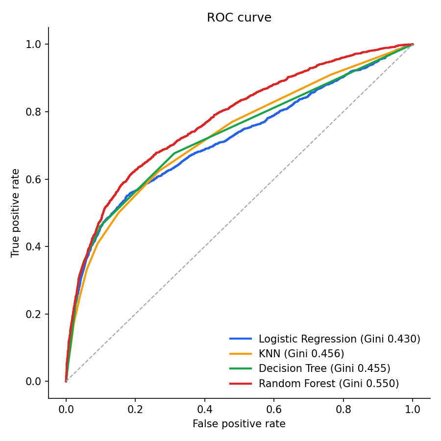
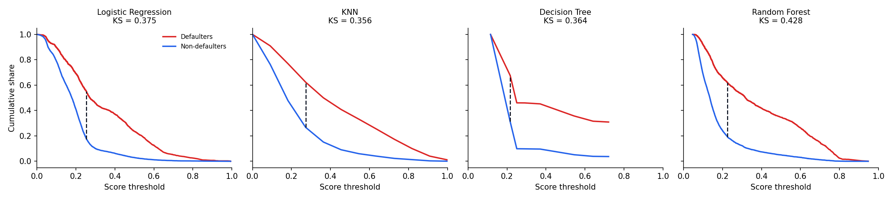
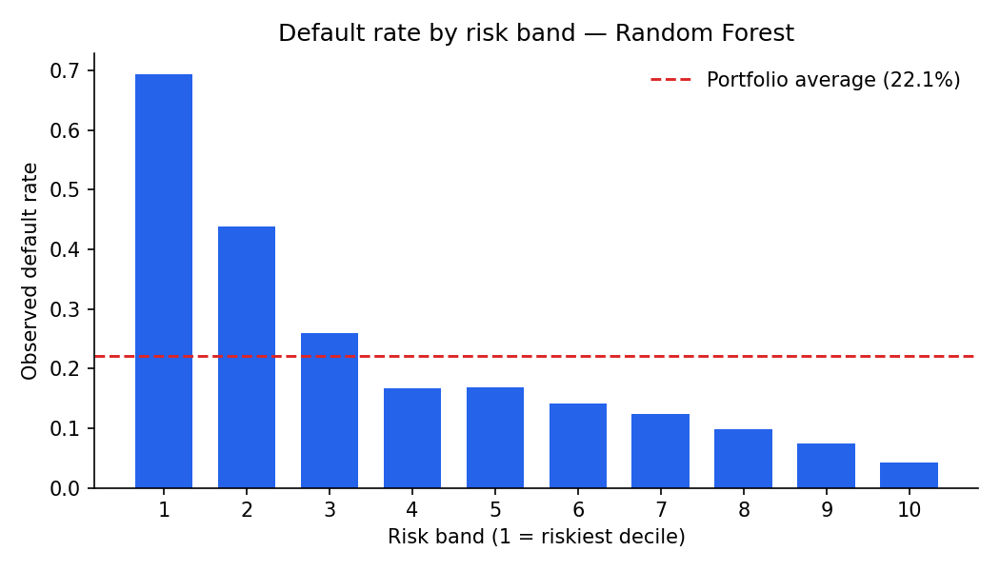
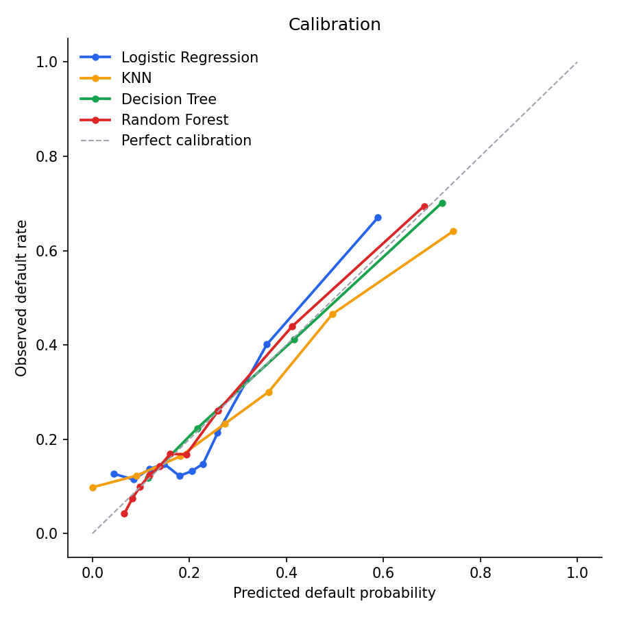

# Credit Default Models

A benchmark of four classification models for consumer credit default prediction,
evaluated the way a credit risk team would actually evaluate them — on discrimination,
calibration and population stability, not on accuracy.

**Dataset** — [UCI Default of Credit Card Clients](https://archive.ics.uci.edu/dataset/350/default+of+credit+card+clients):
30,000 Taiwanese credit card accounts (2005), 23 features covering credit limit,
demographics, and six months of repayment, billing and payment history. The target is
default in the following month.

---

## Why not accuracy

The portfolio defaults at roughly 22%. A model that predicts *nobody defaults* scores
78% accuracy and is worth nothing — it makes no decision. The metrics that survive
contact with a credit committee are different:

| Metric | Question it answers |
|---|---|
| **KS** | How far apart can the model pull defaulters from non-defaulters? |
| **Gini** | How well does it rank the portfolio, end to end? |
| **Calibration** | Is a predicted 8% actually an 8% — or only *higher than 5%*? |
| **PSI** | Is the population the model sees today still the one it was built on? |
| **Risk bands** | If we cut here, how much loss do we avoid and how much volume do we lose? |

Ranking and level are separate problems. A model can rank beautifully and still be
badly calibrated — fine for a cut-off policy, disqualifying for pricing or expected-loss
provisioning, which need the probability itself to be trustworthy.

## Models

| Model | Why it is here |
|---|---|
| Logistic Regression | The reference. Most deployed scorecards still are one — monotonic, auditable, translatable into points |
| KNN | Purely local, no global structure — a lower bound on what geometry alone buys |
| Decision Tree (depth 3) | Readable rules; the shallow depth is deliberate |
| Random Forest | Measures how much signal the linear model leaves behind |

Every model is wrapped in a `Pipeline` with `StandardScaler`, so scaling is fitted
inside each fold rather than on the full dataset. This is not cosmetic: `LIMIT_BAL`
reaches 1,000,000 NT$ while `AGE` sits in the tens, so an unscaled KNN neighbourhood
is decided almost entirely by the credit limit column.

## Results

30,000 accounts · 23 features · 22.12% default rate · 70/30 stratified split.

| Model | KS | Gini | AUC | PSI (train vs. test) |
|---|---:|---:|---:|---:|
| **Random Forest** | **0.4278** | **0.5498** | **0.7749** | 0.0019 |
| Logistic Regression | 0.3751 | 0.4301 | 0.7150 | 0.0009 |
| Decision Tree | 0.3641 | 0.4552 | 0.7276 | 0.0001 |
| KNN | 0.3562 | 0.4556 | 0.7278 | 0.0009 |

Random Forest wins on every metric — KS 0.43 is a healthy behavioural scorecard, and
the ~5 point Gini gap over Logistic Regression is the price of insisting on a linear,
auditable model. Whether that price is worth paying is a governance question, not a
modelling one.

**The ordering is not the same under KS and Gini**, and that is the most useful thing
in the table. Logistic Regression has the higher KS of the three non-ensemble models
(0.3751) but the *lowest* Gini (0.4301) — Decision Tree and KNN both rank better
overall while separating worse at their best single cut-off.

The two metrics are answering different questions. KS is the maximum separation at
*one* threshold; Gini integrates ranking quality across *all* of them. A model can win
at the operating point you happen to care about and still be the weakest across the
book. Which one should decide the model depends entirely on whether the policy is a
single cut-off or a tiered one — and reporting only AUC, as the original script did,
hides the distinction completely.

PSI sits near zero for every model, which is exactly what a random split should
produce. It is here as a calibrated sense of what "stable" looks like, so the same
check means something when it is run against a later origination cohort instead.

### Discrimination





KS is drawn literally above — the vertical gap between the cumulative distribution of
defaulters and non-defaulters, at the threshold where that gap is widest. The Decision
Tree panel shows why depth 3 is a real constraint: with only a handful of distinct leaf
scores, its curves move in steps, and the whole model has fewer places it can cut.

### Risk bands



| Band | Accounts | Defaults | Default rate | Lift | Cumulative defaults captured |
|---:|---:|---:|---:|---:|---:|
| 1 | 900 | 625 | **69.44%** | 3.14 | 31.4% |
| 2 | 900 | 395 | 43.89% | 1.98 | 51.2% |
| 3 | 900 | 234 | 26.00% | 1.18 | 63.0% |
| 4 | 900 | 151 | 16.78% | 0.76 | 70.6% |
| 5 | 900 | 152 | 16.89% | 0.76 | 78.2% |
| 6 | 900 | 128 | 14.22% | 0.64 | 84.6% |
| 7 | 900 | 112 | 12.44% | 0.56 | 90.3% |
| 8 | 900 | 89 | 9.89% | 0.45 | 94.7% |
| 9 | 900 | 67 | 7.44% | 0.34 | 98.1% |
| 10 | 900 | 38 | **4.22%** | 0.19 | 100.0% |

The separation is steep enough to build a policy on. The riskiest decile defaults at
69.4% against a 22.1% portfolio average, the safest at 4.2% — **sixteen to one**, top to
bottom. Cutting the worst 20% of the book removes **51% of all defaults**; the worst 30%
removes 63%.

Bands 4 and 5 invert, at 16.78% and 16.89%. On 900 accounts each that gap is one
defaulter wide and well inside sampling noise — worth noting, not worth acting on.

### Calibration



Random Forest and the Decision Tree track the diagonal closely across the range. KNN is
the weakest by a distance: it never resolves below about 10% observed default even at its
lowest scores, so it cannot identify a genuinely safe segment at all, and it pulls back
in at the top.

Logistic Regression is the surprise. It wanders non-monotonically through the 0.10–0.20
predicted band — which is exactly where the bulk of the portfolio sits. It ranks
acceptably there while its probabilities cannot be trusted as levels.

That distinction has teeth. For a pure cut-off policy the wobble is tolerable, since only
the ordering matters. For pricing or expected-loss provisioning, where the predicted
probability gets multiplied by exposure, it is disqualifying in the densest part of the
book — and no amount of AUC would have revealed it.

Full numeric output: [`reports/results.md`](reports/results.md). The figures above are
committed rather than gitignored, so the results are readable without running anything.

## Running it

```bash
pip install -r requirements.txt
python run.py
```

The dataset downloads itself from the UCI archive on first run and is cached in
`data/`. Everything is seeded — a rerun reproduces the committed numbers.

## Layout

```
├── run.py              entry point: trains, scores, writes figures and results
├── src/
│   ├── data.py         dataset download, loading, feature dictionary
│   ├── models.py       the four pipelines
│   └── metrics.py      KS, Gini, PSI, risk band table
└── reports/            generated figures and results.md
```

## Origin

Undergraduate research at UNICAMP (2024) — *Traditional vs. Machine-Learning Models
for Credit Scoring* — recognized among the **100 best undergraduate projects** at the
university. Rebuilt here to evaluate the same models against the criteria that credit
risk work actually runs on, rather than the ones a classification tutorial reaches for.

## Reference

Yeh, I. C., & Lien, C. H. (2009). *The comparisons of data mining techniques for the
predictive accuracy of probability of default of credit card clients.*
Expert Systems with Applications, 36(2), 2473–2480.

## License

MIT
